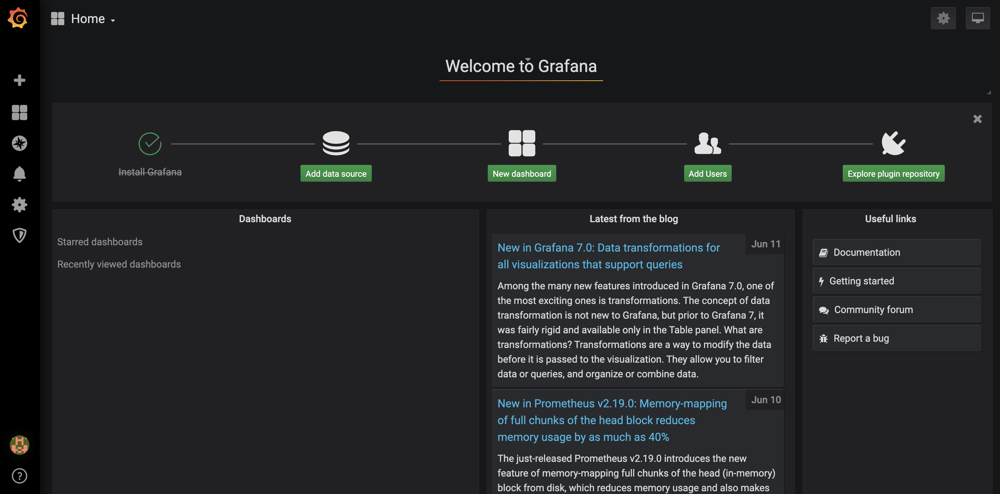
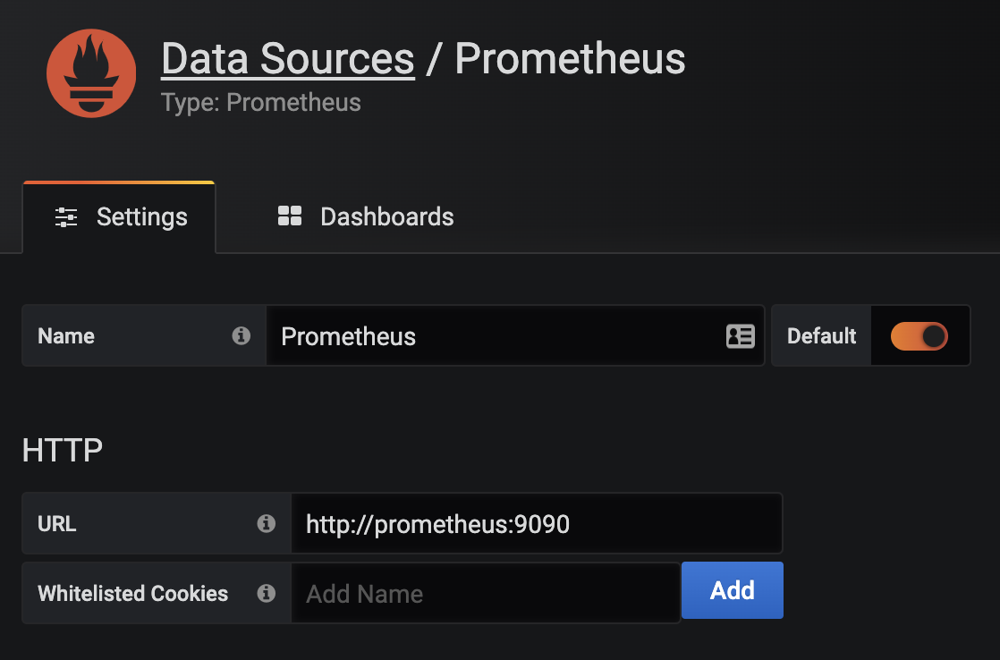
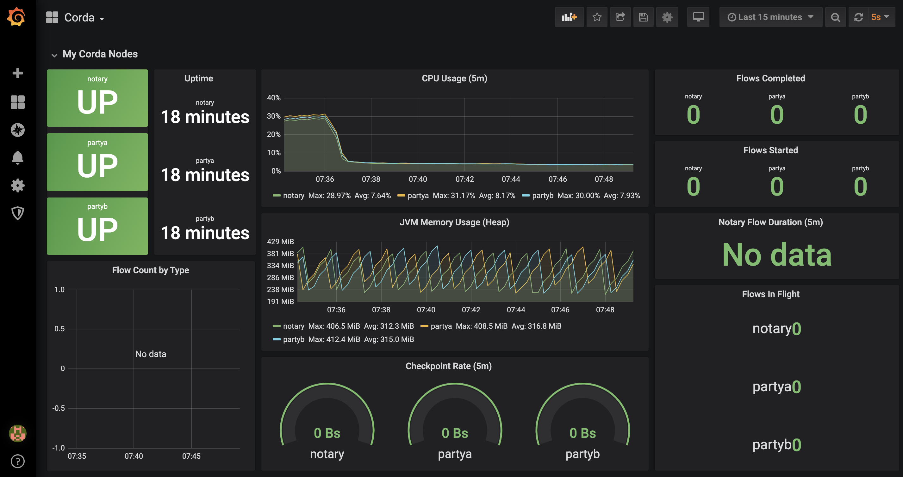
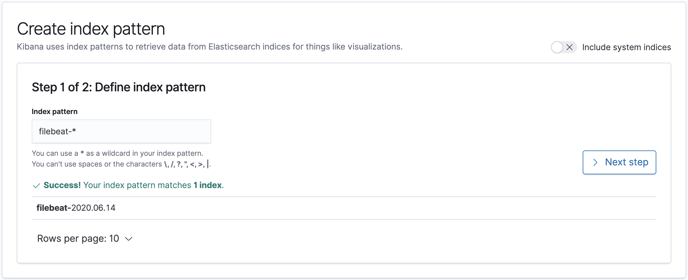
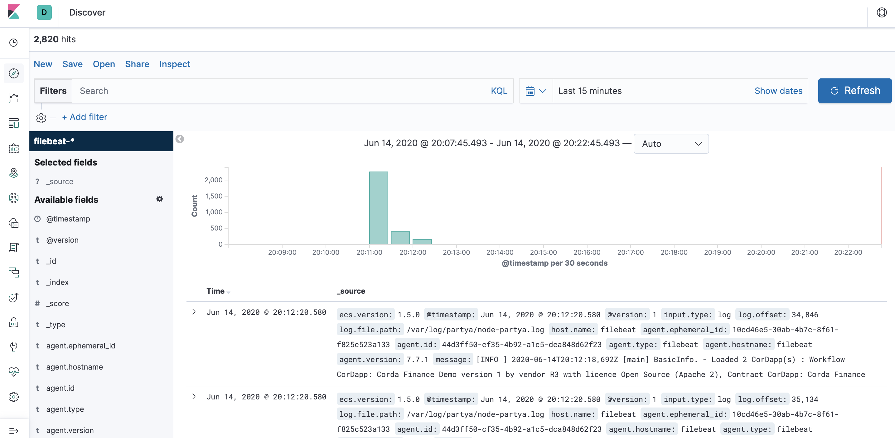

The terraform in this repo has been developed to run locally from each developers machine with the state file stored locally. This way developers will be in charge of their own environments and there will be no issues of accidental file deletion or reliance on someone else to fix their mistakes in order to setup a new environment.

The aws authentication method used to test this guide was to set the AWS [environment variables](https://docs.aws.amazon.com/cli/latest/userguide/cli-configure-envvars.html?icmpid=docs_sso_user_portal) 

# Prerequisites
You will need to install the following applications onto your machine:

```
ansible 2.11.6
Packer v1.7.8
Terraform v1.0.8
aws-cli/2.2.40
```


[Administrators start here](#step-1-build-the-packer-environment) - Steps 1 and 2 will only need to be completed once by an administrator and used to create the ami's needed for the environments.

[Developers start here](#step-8-provisioning-additional-test-environments) Your ami's should already have been created by the admin so you can skip to the deployment stage

# Step 1. Build the packer environment

Create the build vpc for creating the corda ami's
```
cd prerequisites
terraform init
terraform apply
```

# Step 2. Create your ami
Once you have installed the prereqs build your images using the following commands:

1. Install External roles
```
ansible-galaxy install -r packer/ansible/roles/requirements.yml --roles-path packer/ansible/roles --force
```
2. Create base ami
```
cd  packer
packer build -var-file="config/aws.json" corda_base_ami.json
```
3. Create Corda ami
```
cd packer (if you are not already in the directory)
packer build -var-file="config/aws.json" corda_ami.json
```

# Step 3. Provision your environment
The quickstart file inside the terraform directory has been created to get a corda network up and running as quick as possible. The first time you run this you will not need to make any changes to the file. To get the infrastructure up and running run the following commands.

1. Run the terraform
```
cd terraform
terraform init --reconfigure
terraform apply
```

Once the terraform has run you will get the following outputs.
```
quickstart_bastion_dns = "ec2-35-88-188-218.us-west-2.compute.amazonaws.com"
quickstart_corda_private_ip = "10.1.2.187"
quickstart_grafana_endpoint = "quickstarts-alb-1251387190.us-west-2.elb.amazonaws.com:3000"
quickstart_kibana_endpoint = "quickstarts-alb-1251387190.us-west-2.elb.amazonaws.com:5601"
quickstart_ssh_to_corda_instance = "ssh -i quickstart -F config_quickstart 10.1.2.187"
```
2. Copy config file
```
cp config_* ~/.ssh/config
```
3. make a note of the corda_private_ip, grafana_endpoint and the kibana_endpoint from the terraform output

4. To test that the Corda finance demo app works and that your Corda network is working move to [Step 7 Testing the Corda finance demo app](#step-7-testing-the-corda-finance-demo-app)

## Don't forget to whitelist your ip address. Find your public IP and add it into your quickstart file terraform/quickstart.tf. Examples have been given on lines 17 and 18 for either whitelisting a signle public ip address or whitelisting multiple public id addresses. If you leave this blank your corda network will be left open for anyone to access.

# Step 4. Run your own cordapps

1. Copy your cordapp jar files into ansible/roles/corda-migration/files
2. Update your corda_private_ip from the terraform steps into  corda-dtcc/ansible/inventories/corda (replace the placeholder ip 10.1.2.187)
3. run the ansible-playbook command
```
ansible-playbook -i inventories/corda corda.yml
```

# Step 5 Configure Grafana
The grafana endpoint was output to the screen in part 2 of this guide.

Grafana will ask you for a login, the default admin login is:

- Username: admin
- Password: admin

Change your password as instructed, and then you should see the Grafana homepage.



Click on `Add data source`.

Select the `Prometheus` data source under `Time series databases`.

Under `HTTP`, set the `URL` to `http://prometheus:9090`.  You can use the Prometheus Docker container hostname here as all of the containers run on the same Docker bridge network, so no explicit container IP addresses need to be used for connectivity.



At the bottom of the page, click on `Save & Test`.  You should see a green alert - `Data source is working`.

Hover over the `Dashboards` icon, and click `Manage`.

Click `Import`, then `Upload .json file`, and navigate to the clone repository folder.  Inside the `grafana` folder, you will see a json file - `Grafana-Corda-Dashboard.json`, see [here](./grafana/Grafana-Corda-Dashboard.json).

On the following screen, click `Import`.

Boom, a dashboard appears!



# Step 6 Configure Kibana

Open the kibana endpoint in your browser

Select Explore on my own

Click the left pane followed by Discover (Under Analytics)

click `Index Patterns`.

Click `Create Index Pattern`.

In the `Index pattern` field, enter `filebeat-*`.



Click `Next step`.

Under the `Time Filter field name` dropdown, select `@timestamp`.

Click `Create Index Pattern`.

Voila, your index pattern has been created!

Click on the `Discover` icon on the left pane, you should see some logs:



# Step 7 Testing the Corda finance demo app

SSH into the PartyA node Crash shell:

```bash
➜ ssh user@localhost -p 2222
```

When prompted, the password is `password`.

You should see the following in your terminal:

```bash
Welcome to the Corda interactive shell.
You can see the available commands by typing 'help'.

Mon Jun 15 07:52:13 GMT 2020>>>
```

Let's execute a `CashIssueAndPaymentFlow`:

```bash
Mon Jun 15 07:53:52 GMT 2020>>> flow start CashIssueAndPaymentFlow amount: 1000 GBP, issueRef: TestTransaction, recipient: PartyB, anonymous: false, notary: Notary

 ✓ Starting
 ✓ Issuing cash
          Generating anonymous identities
     ✓ Generating transaction
     ✓ Signing transaction
     ✓ Finalising transaction
              Requesting signature by notary service
                  Requesting signature by Notary service
                  Validating response from Notary service
         ✓ Broadcasting transaction to participants
 ✓ Paying recipient
     ✓ Generating anonymous identities
     ✓ Generating transaction
     ✓ Signing transaction
     ✓ Finalising transaction
         ✓ Requesting signature by notary service
             ✓ Requesting signature by Notary service
             ✓ Validating response from Notary service
         ✓ Broadcasting transaction to participants
▶︎ Done
Flow completed with result: Result(stx=SignedTransaction(id=FB08662B2E0A19ECF9B0E3E44D2DF25934F9576DBF262D794EE2C795C3269503), recipient=O=PartyB, L=London, C=GB)
```

# Step 8 Provisioning additional test environments
Steps 1 and 2 only needed to be run once. Any subsequent runs only require the terraform to create the environment. 

As we are using a terraform module to create the infrastructure for us, the easiest way to do this for us is to use the quickstart.tf as a template file. If you have already created an environment in step 3 using the quickstart.tf file and would like to keep that environment then duplicate the file and make the following changes:
* edit the file to change any occurences of the word 'quickstart' to your name (command + shift + l selects all occurences of a string on vscode)
* update the cidr prefix on line 6 to the next available range. (You can keep the same cidr if you want as we are not creating any vpc peering connections so we shouldn't see any ip conflicts but it's just cleaner to pick a new range)

Once your file is ready, run the following:
```
cd terraform
terraform init --reconfigure
terraform apply
cp config_* ~/.ssh/config
```

If this looks familiar it is because these are the same steps you ran in [step 3](#step-3-provision-your-environment)

Once your environment is up and running you can load your own cordapps by running [step 4](#step-4-run-your-own-cordapps)

## Don't forget to whitelist your ip address. Find your public IP and add it into your quickstart file terraform/quickstart.tf. Examples have been given on lines 17 and 18 for either whitelisting a signle public ip address or whitelisting multiple public id addresses. If you leave this blank your corda network will be left open for anyone to access.